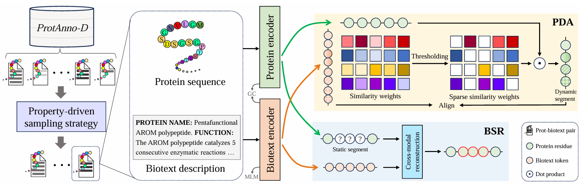
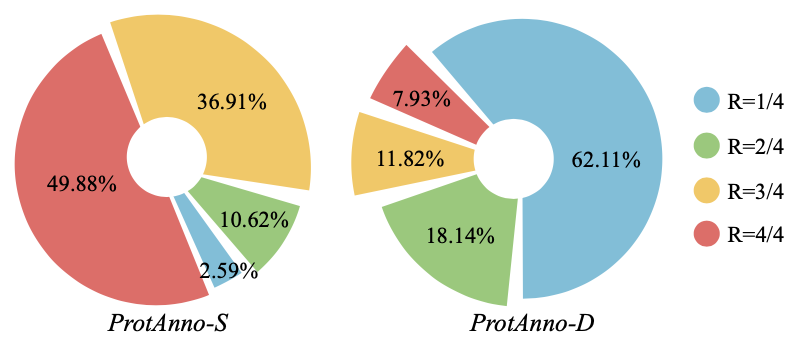
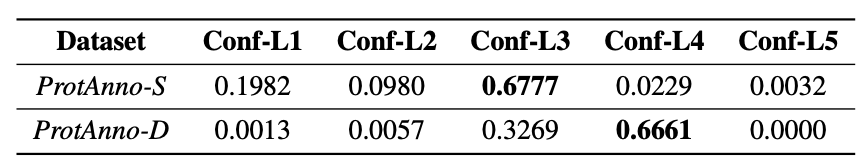

# ProtCLIP: Function-Informed Protein Multi-Modal Learning
ProtCLIP is a protein multi-modality foundation model for protein sequence understanding, aligning protein sequences and biotexts, as introduced in our [AAAI 2025 oral paper](https://ojs.aaai.org/index.php/AAAI/article/view/34456). And we have contained more technical details in the [arXiv version](https://arxiv.org/abs/2412.20014).

 
Figure 1: Overview of ProtCLIP.

Multi-modality pre-training paradigm that aligns protein sequences and biological descriptions has learned general protein representations and achieved promising performance in various downstream applications. However, these works were still unable to replicate the extraordinary success of language-supervised visual foundation models due to the ineffective usage of aligned protein-text paired data and the lack of an effective function-informed pre-training paradigm. To address these issues, this paper curates a large-scale protein-text paired dataset called ProtAnno with a property-driven sampling strategy, and introduces a novel function-informed protein pre-training paradigm. Specifically, the sampling strategy
determines selecting probability based on the sample confidence and property coverage, balancing the data quality and data quantity in face of large-scale noisy data. Furthermore, motivated by significance of the protein specific functional mechanism, the proposed paradigm explicitly model protein static and dynamic functional segments by two segment-wise pre-training objectives, injecting fine-grained information in a function-informed manner. Leveraging all these innovations, we develop ProtCLIP, a multi-modality foundation model that comprehensively represents function-aware protein embeddings. On 22 different protein benchmarks within 5 types, including protein functionality classification, mutation effect prediction, cross-modal transformation, semantic similarity inference and protein-protein interaction prediction, our ProtCLIP consistently achieves SOTA performance, with remarkable improvements of 75% on average in five cross-modal transformation benchmarks, 59.9% in GO-CC and 39.7% in GO-BP protein function prediction. The experimental results verify the extraordinary potential of ProtCLIP serving as the protein multi-modality foundation model.


## Multi-Modal Aligned Dataset
The pre-training dataset for ProtCLIP is built on large-scale protein corpus [UniProt](https://www.uniprot.org/). 

Our pre-training data is sourced from SwissProt and trEMBL, containing proteins with textual descriptions. We align protein sequences with meticulously selected properties to curate
ProtAnno, which is available in sparse version (ProtAnno-S) and dense version (ProtAnno-D). ProtAnno-S includes manually reviewed protein-biotext pairs with higher annotation quality, whereas ProtAnno-D comprises mostly computationally analyzed protein-biotext pairs which are less accurate due to the machine-annotated bias. To gain more insights into the dataset, we conduct extensive quantitative analyses, and display the compositional structure of ProtAnno with varying confidence and property coverage.

The compiled dataset can be accessed through the Zenodo repository: [ProtAnno](https://zenodo.org/records/15245588)

 
Figure 2: Data distribution of ProtAnno-S and ProtAnno-D with different property coverage.

 
Table 1: Data distribution of ProtAnno-S and ProtAnno-D with different sample confidence.

Note that the ProtAnno-D dataset has been filtered using the property-driven sampling strategy.

## Pretrained Model Zoo
We hope ProtCLIP could serve as the protein multi-modality foundation model to promote controllable protein discovery and optimization in real-world scenarios.

ProtCLIP: [config](https://github.com/diaoshaoyou/ProtCLIP/blob/main/config/config.json) | [checkpoint](https://zenodo.org/records/15245588/files/model.safetensors?download=1)

## Usage
We train and test our models on Platform of Artificial Intelligence (PAI) from Alibaba Cloud. Here are some basic setups:
```
deepspeed zero1
gradient_checkpointing=True
pretraining/testing batch size=64
```
For better understanding, here is the directory structure for the related code files:
/root
├── DATA
│   ├── backbones (to be downloaded)
│   ├── checkpoint (to be downloaded)
│   ├── downstream
│   └── datasets (to be downloaded)
│       ├── downstream dataset: AAV
│       ├── downstream dataset: Reaction
│       ├── ...
│       └── pretraining dataset: ProtAnno
│           ├── ProtAnno-S.json (i.e. train.json, to be downloaded)
│           ├── ProtAnno-D.json (i.e. train_new.json, to be downloaded)
│           └── valid.json
└── CODE
    └── protclip

### Dataset
Beyond the accessed pretraining dataset above, we also include filtering codes for generating ProtAnno in [sampling.py](https://github.com/diaoshaoyou/ProtCLIP/blob/main/src/sampling.py). Please download orignal data from SwissProt and trEMBL before running ``sampling.py``. You can adjust exponents of different variables to control the filtering intensity. For arrangement of downstream datasets and tasks, KG follows [BioBridge](https://github.com/RyanWangZf/BioBridge) and others follows [ProtST](https://github.com/DeepGraphLearning/ProtST/blob/main/script/prepare_all_datasets.py).

### Installation
You may install the dependencies of ProtCLIP as below.
```
conda create -n protein python=3.9
conda activate protein
conda install pytorch==2.0.1 torchvision==0.15.2 torchaudio==2.0.2 pytorch-cuda=11.7 -c pytorch -c nvidia
conda install torchdrug pytorch-sparse pytorch-scatter pytorch-cluster -c pytorch -c pyg -c milagraph
conda install scikit-learn pandas decorator ipython networkx tqdm matplotlib -y
conda install fair-esm easydict pyyaml lmdb
pip install deepspeed==0.12.4
pip install transformers==4.35.2 accelerate==0.25.0 datasets peft
pip install wandb
```

### Pre-training
You can run ``train_pai.sh`` to perform pretraining tasks.

### Downstream
You can run ``downstream_pai.sh`` to perform downstream tasks. We provide neccessary configuration files in [downstream_config.json](https://github.com/diaoshaoyou/ProtCLIP/blob/main/downstream_config.json) and default values are used for the remaining hyperparameters.

## License
This codebase is released under the Apache License 2.0 as in the [LICENSE](https://github.com/diaoshaoyou/ProtCLIP/blob/main/LICENSE) file.
)
## Citation
If you find this research work interesting and helpful, please cite our paper:
```
@inproceedings{zhou2025protclip,
  title={ProtCLIP: Function-Informed Protein Multi-Modal Learning},
  author={Zhou, Hanjing and Yin, Mingze and Wu, Wei and Li, Mingyang and Fu, Kun and Chen, Jintai and Wu, Jian and Wang, Zheng},
  booktitle={Proceedings of the AAAI Conference on Artificial Intelligence},
  volume={39},
  number={21},
  pages={22937--22945},
  year={2025}
}
``` 

