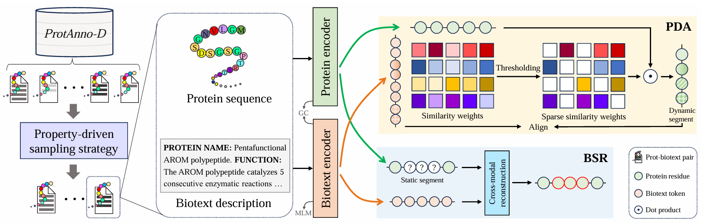

# ProtCLIP
ProtCLIP is a protein multi-modality foundation model for protein sequence understanding, aligning protein sequences and biotexts, as introduced in AAAI2025 paper.

## Installation

## Pretrained Model Zoo

## Usage

## License
This codebase is released under the Apache License 2.0 as in the [LICENSE](https://github.com/diaoshaoyou/ProtCLIP/blob/main/LICENSE) file.

## Citation
We have contained more technical details in arXiv version. Please cite our paper as follows:

